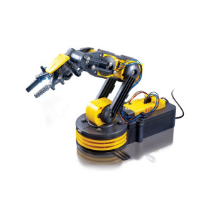
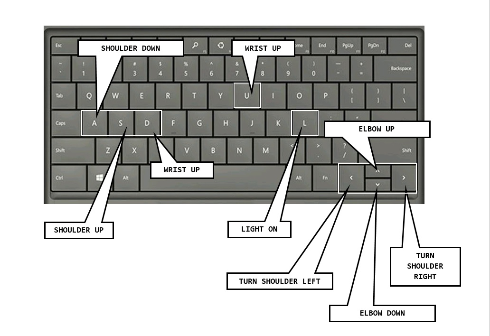

# PyGame_Robot_Brawl
A Pygame program to control the Maplin Robot Arm.

My Computing club coded this soultion to control the Maplin Robot Arm with the Raspberry Pi and aslo Pygame.  

Pygame adds the control of the movements of the arm which are mapped to the keyboard.

The students then decided to code up another Arm and play basketball, then some of them wanted to have a Robot brawl!!  Check out the video below.
